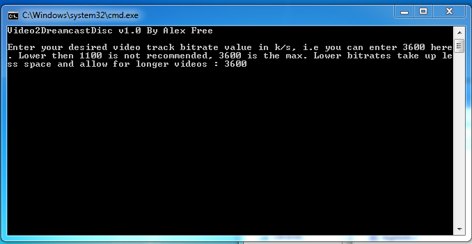
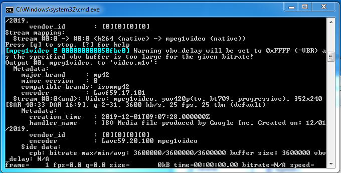
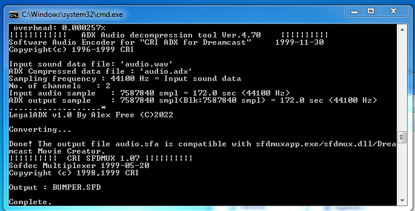
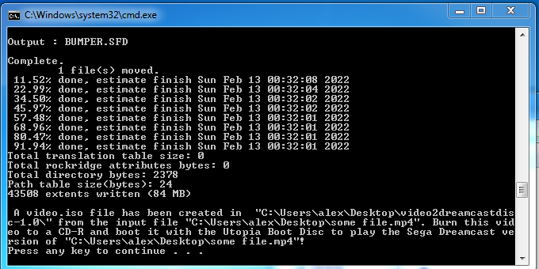

[alex-free.github.io](https://alex-free.github.io)
==================================================

Video2DreamcastDisc
===================

By Alex Free

Video2DreamcastDisc is a complete [suite of programs](#bundled) that can
***automagically* convert any video file** to a `.iso` file (which
autoplays your video on the Sega Dreamcast) which can be burned and then
booted with the [Utopia Boot
Disc](https://en.wikipedia.org/wiki/Utopia_bootdisk).

How it works:

-   Burn the `Utopia CD Loader V1.2.cdi` file in the
    [Video2DreamcastDisc directory](#downloads) to a CD-R.
-   Drop the media file you want to play on the Sega Dreamcast on the
    `vid2dcd.bat` file in the release, a `video.iso` file will be
    generated. Burn the `video.iso` file with a CD-R writing program
    (like [imgburn](https://www.imgburn.com/),
    [cdrdao](http://cdrdao.sourceforge.net/),
    [cdrecord](http://cdrtools.sourceforge.net/private/cdrecord.html),
    etc.). **do not use Windows Explorer**.
-   Boot the Sega Dreamcast with the Utopia Boot Disc CD-R burned
    previously. Once the reindeer appears swap the
    `Utopia CD Loader V1.2.cdi` CD-R with the `video.iso` CD-R.
-   Close the lid, the video will autoplay. When done, **turn the Sega
    Dreamcast off** before removing the `video.iso` CD-R.

For more info on using the `vid2dcd.bat` script, see the [Usage](#usage)
section.

[Homepage](https://alex-free.github.io/video2dreamcastdisc) \|
[GitHub](https://github.com/alex-free/video2dreamcastdisc)

Table Of Contents
-----------------

-   [Downloads](#downloads)
-   [Usage](#usage)
-   [FAQ](#faq)
-   [Software Included In Suite](#bundled)

{width="600"} {width="600"}
{width="600"} {width="600"}
[]{#downloads}

Downloads
---------

### v1.0 - 2/13/2022

[Video2DreamcastDisc
v1.0](https://github.com/alex-free/video2dreamcastdisc/releases/download/v1.0/video2dreamcastdisc-1.0-win32.zip)
*For Windows 7 32-bit/64-bit or newer*

Using git:

    git clone https://github.com/alex-free/video2dreamcastdisc

View the Video2DreamcastDisc
[releases](https://github.com/alex-free/video2dreamcastdisc/releases/)
GitHub page.

[]{#usage}

Usage
-----

Video2DreamcastDisc provides the `vid2dcd.bat` script in each release,
which performs all operations. This script accepts only one argument.
You can either:

-   Drag n\' drop a video file into the `vid2dcd.bat` file to start
    converting the dropped file (recommended method).
-   Open `cmd.exe`, and execute `vid2dcd.bat` with an argument like
    `vid2dcd.bat myhuge.mkv`.

When executing the `vid2dcd.bat` with a media file as argument as
explained in the above 2 methods, you will be prompted in the `cmd.exe`
window for your desired video bitrate. This does not effect the audio in
your final video played on the Sega Dreamcast. The maximum video bitrate
you can enter that will actually play on the Sega Dreamcast is `3600`.
This looks great, but it takes up quite a bit of space. You can only
overburn so much to a CD-R, so if you find that using `3600` generates
to big of a `.iso` for you to burn on your CD-R media you should use a
lower value. I recommend not using anything lower then `1100`, but the
choice is yours for the size/length of playback tradeoff

[]{#faq}

FAQ
---

Q: Why does this not make a `.cdi` and instead makes an `.iso`/why does
this not make self-booting Sega Dreamcast Discs?

A: This uses the SFD\_Player Sega Dreamcast program which was released
in 2000 before self-booting Sega Dreamcast Discs other then the Utopia
Boot Disc became a thing.

Q: Well now we know how to make self-booting Sega Dreamcast discs,
can\'t you just update the SFD\_Player with BootDreams or something?

A: Tried that, doesn\'t work. It self-boots right into a white void that
never plays your video. Rumor has it that this SFD\_Player is actually
hacked out of an existing executable from a game, and has been modified
to act as a homebrew thing. Maybe this is why standard scrambling of
`1ST_READ.BIN` does not work for SFD\_Player.

Q: What video track bitrate do I want?

A: If you want the maximum quality your Sega Dreamcast can offer, use
3600. If you can\'t fit your video.iso file Video2DreamcastDisc
generated onto a CD-R with a 3600 bitrate, try converting at 3000, or
2600, or even 1100 for alot more video play time. The lower the video
bitrate, the longer your video can be while still fitting on a CD-R.

Q: What is the audio like in videos? Can I change it?

A: The audio is the highest quality playable with the 3600k/s video
track bitrate, so it\'s at 396k/s stereo (ADX audio). As of v1.0, there
is not yet any way to change this to mono or a different bitrate with a
user facing feature/option in the vid2dcd.bat script.

Q: What resolution is the video on the Sega Dreamcast? Can it be
changed?

A: The resolution is the max, 352x240. There is not yet any way to
change this with a user facing feature/option in the vid2dcd.bat script.

[]{#bundled}

Software Included In Suite
--------------------------

[FFmpeg](https://www.ffmpeg.org/) - this does the intial conversion from
the source file into WAV audio and MPEG-1 video. FFmpeg is licensed
under the GNU GPL v3. See the file `licenses/ffmpeg.txt` in each
Video2DreamcastDisc release for more info. The FFmpeg included in
Video2DreamcastDisc is the \"full\" static build from
[https://www.gyan.dev/ffmpeg/builds](https://www.gyan.dev/ffmpeg/builds/).

Adxencd - released by [dcswat.ru](http://www.dc-swat.ru)
[here](http://www.dc-swat.ru/download/pc/ADX_Tool_Pack_v1.0_by_SWAT.exe).
This converts the WAV file previously converted from the source file
with FFmpeg to an ADX audio file.

LegalADX - this program was written by me in C to do one thing, convert
the audio ADX file to a new one that work with Sfdmuxapp. This is open
source under the 3-BSD license and source code is provided in the
Video2DreamcastDisc releases. See the file `licenses/legaladx.txt` for
more info.

[Sfdmuxapp](https://forum.xentax.com/viewtopic.php?t=3084) - created by
[Zench](https://forum.xentax.com/memberlist.php?mode=viewprofile&u=4697&sid=d224e63302049b15631fe92cb3527c94),
released on July 15th 2008. This is a command line program that
interfaces with the `Sfdmux.dll` from the [Sega Dreamcast Movie
Creator](http://www.dc-swat.ru/download/pc/SFD_Tool_Pack_v1.0_by_SWAT.exe).
This converts and merges both the audio adx file and the mpeg1 video
into a single sofdec file.

[SFD\_Player](http://www.dc-swat.ru/download/dc/SFD_Player.7z) -
released all the way back in 2000, this Sega Dreamcast program
automatically plays the `movie/BUMPER.SFD` file on the disc it is burned
to.

[MKISOFS](http://cdrtools.sourceforge.net/private/cdrecord.html) -
creates the 2048 MODE 1 data video.iso file which auto-plays your video
on the Sega Dreamcsast when booted with the Utopia Boot Disc. MKISOFS is
a part of , which is licensed under the ‎GNU GPL‎ and CDDL licenses. See
the files `licenses/mkisofs-gpl3.txt` and `licenses/mkisofs-cddl.txt` in
each Video2DreamcastDisc release directory for more info.

[Utopia Boot Disc](https://en.wikipedia.org/wiki/Utopia_bootdisk) - the
original Sega Dreamcast backup method. It is essentially a self-bootable
loader that is used to then boot the CD-R burned with the iso containing
the auto playing video.
