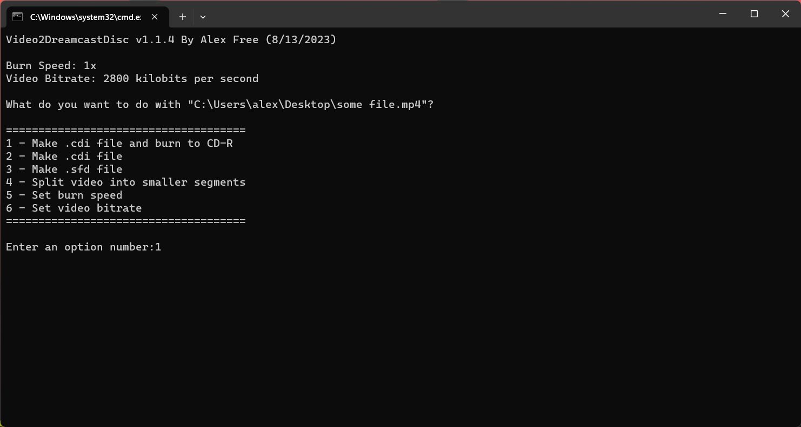
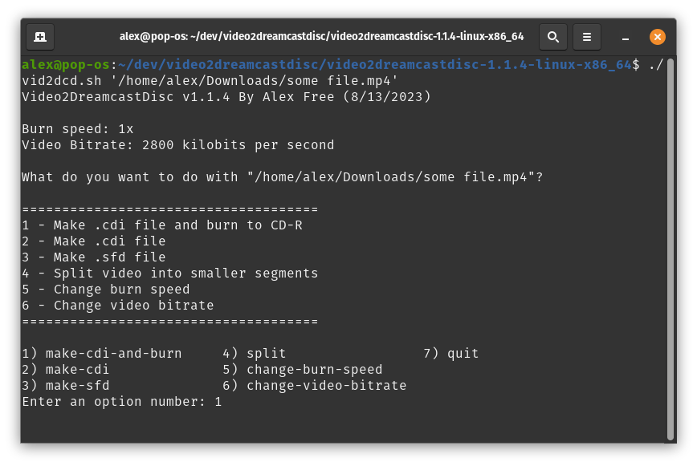
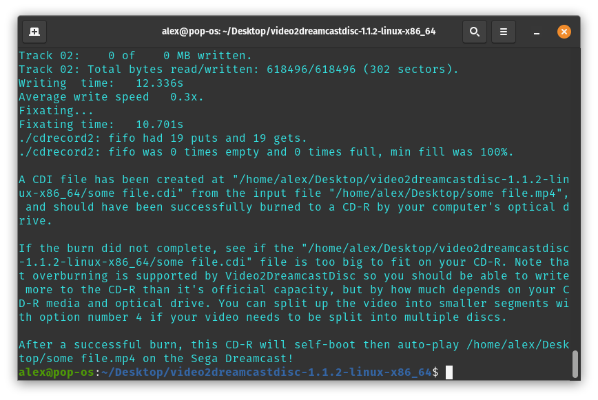

# [alex-free.github.io](https://alex-free.github.io)

# Video2DreamcastDisc

By Alex Free

Video2DreamcastDisc is a complete [suite of programs](#software-suite) that can convert **any video file (30 fps or lower)** for playback on a Sega Dreamcast console using the [Sofdec](https://segaretro.org/Sofdec) video format (used by in-game FMVs). You can convert media files to a self-booting, auto-playing, Sega Dreamcast `.cdi` file that can be burned to a CD-R for playback of said media on Mil-CD exploitable consoles. 

Video2DremacastDisc can also be used as a modern replacement for the [Sega Dreamcast Movie Creator](http://www.dc-swat.ru/download/pc/SFD_Tool_Pack_v1.0_by_SWAT.exe) in a workflow for [creating Sofdec FMV files](#option-4).

## Table Of Contents

*   [Downloads](#downloads)
*   [Usage](#usage)
*   [Video Specifications](#svideo-specifications)
*   [Software Suite](#software-suite)

## Links

*   [Homepage](https://alex-free.github.io/video2dreamcastdisc)
*   [GitHub](https://github.com/alex-free/video2dreamcastdisc)

## Downloads

**The Linux builds are portable, although they do require [wine](https://www.winehq.org/) to be installed to work due to a few remaining windows-only programs needed in the conversion process.**

### Version 1.1.4 (8/13/2023)

*   [Windows x86](https://github.com/alex-free/video2dreamcastdisc/releases/download/v1.1.4/video2dreamcastdisc-1.1.4-windows-x86.zip) _For Windows 10 32-bit/64-bit or newer_.

*   [Linux x86\_64](https://github.com/alex-free/video2dreamcastdisc/releases/download/v1.1.4/video2dreamcastdisc-1.1.4-linux-x86_64.zip) _For x86_64 Linux Distributions_ . 

Changes:

*   New option 5 allows setting the burn speed as a saved config file setting. The default is 1 (slowest speed your drive supports will be used).
*   New option 6 allows setting the video bitrate as a saved config file setting. The default is 2800 (highest recommended value).
*   Fixed option 4 in the Linux version.

[About previous versions](changelog.md).

## Usage

Video2DreamcastDisc is driven a command line interface provided by the `vid2dcd.bat` script (Windows) or the `vid2dcd.sh` script (Linux), which are found in each release. These scripts accept only one argument. You can Drag n' drop a video file into the `vid2dcd.bat` script on Windows to provide said argument. You can also do this with the `vid2dcd.sh` script on most Linux distributions. Alternatively on Windows, you may open `cmd.exe`, and execute `vid2dcd.bat` with an argument like `vid2dcd.bat myhuge.mkv`. On Linux, you may also do this by opening the Terminal and executing `./vid2dcd.sh` with an argument like `./vid2dcd.sh somerandom.mp4`.

With a media file as the only argument to these scripts, an option select menu will be displayed. Select an option by typing the corresponding number.

### Option 1 

Create a `video.cdi` file in the Video2DreamcastDisc directory and burn that file automatically to a blank CD-R, all in one go.

### Option 2 

Create a `video.cdi` file in the Video2DreamcastDisc directory that can be burned to a CD-R for Sega Dreamcast playback.

### Option 3 

Create a `video.sfd` file in the Video2DreamcastDisc directory.

### Option 4 

Split an existing video file into multiple segments that are each limited to a maximum amount of minutes per segment specified by you. This means you can take a very long video file and split it into i.e. 25 minute segments so that each part of the video can be it's own video file which individually fis on it's own CD-R. A movie could be split like this to be converted by Video2DreamcastDisc afterwards for playback via multiple CD-Rs.

## Option 5

Set the speed at which the CD-R will be burned with. This setting is 1 by default, which will use the slowest speed your drive supports.

## Option 6

Set the video bitrate in kilobits per second. 1000-2800 is the recommended range.

 

 

 

 

 

 

If you select option 1 on Linux, you'll need to enter your account password to allow Video2dreamcastdisc access to burn the CD-R:

 

### Video Specifications

*   Resolution: 352x240 (maximum supported by SFD\_Player)
*   Video Format: Sofdec Video
*   Video bitrate: User selectable (default 2800 kilobits per second)
*   Audio Format: Stero ADX
*   Audio bitrate: 396 kilobits per second (maximum supported by SFD\_Player)

## Software Suite

Video2DreamcastDisc itself is released into the public domain, (`licenses/video2dreamcastdisc.txt`). The `vid2dcd.sh` and `vid2dcd.bat` scripts use the following software:

### [FFprobe](https://www.ffmpeg.org/)

Use: Displays media file info for [option 4](#option-4).

Versions: 2023-08-07-git-d295b6b693 `ffmpeg-git-full`, pre-built static binaries from [https://www.gyan.dev/ffmpeg/builds](https://www.gyan.dev/ffmpeg/builds/) (Windows), 20230721 `ffmpeg-git-amd64-static` pre-built static binaries from [https://johnvansickle.com/ffmpeg/](https://johnvansickle.com/ffmpeg/).

License: GNU GPL v3 (`licenses/ffprobe.txt`).

### [FFmpeg](https://www.ffmpeg.org/)

Use: Does the initial conversion from the source file into WAV audio and MPEG-1 video, which are then usable by `adxencd`.

Versions: 2023-08-07-git-d295b6b693 `ffmpeg-git-full`, pre-built static binaries from [https://www.gyan.dev/ffmpeg/builds](https://www.gyan.dev/ffmpeg/builds/) (Windows), 20230721 `ffmpeg-git-amd64-static` pre-built static binaries from [https://johnvansickle.com/ffmpeg/](https://johnvansickle.com/ffmpeg/).

License: GNU GPL v3 (`licenses/ffmpeg.txt`).

###   [Adxencd](http://www.dc-swat.ru/download/pc/ADX_Tool_Pack_v1.0_by_SWAT.exe) 

Use: This converts the WAV file previously converted from the source file with FFmpeg to an ADX audio file.

Version: 1.0.

License: Released by [dcswat.ru](http://www.dc-swat.ru) from leaked Dreamcast SDK...

### LegalADX

Use: This program was written by me in C to do one thing, convert the audio ADX file output from adxencd.exe to one that work with [Sfdmuxapp](https://forum.xentax.com/viewtopic.php?t=3084).

Version: 1.0.

License: 3-BSD (`licenses/legaladx.txt`).

### [Sfdmuxapp](https://forum.xentax.com/viewtopic.php?t=3084)

Use: Created by [Zench](https://forum.xentax.com/memberlist.php?mode=viewprofile&u=4697&sid=d224e63302049b15631fe92cb3527c94), released on July 15th 2008. This is a command line program that interfaces with the `Sfdmux.dll` from the [Sega Dreamcast Movie Creator](http://www.dc-swat.ru/download/pc/SFD_Tool_Pack_v1.0_by_SWAT.exe) which allows for command line automated conversion to the SFD format. This uses the output of `legaladx` and the MPEG-1 video track as input to convert it to SFD format.

Version: 1.0.

###  [SFD\_Player](http://www.dc-swat.ru/download/dc/SFD_Player.7z)

Use: Released all the way back in 2000, this Sega Dreamcast program automatically plays the `movie/BUMPER.SFD` file on the disc it is burned to. I have updated the original release using the ECHELON method for self-boot so that it does not require the Utopia Boot Disc!

Version: 1.0.

License: Apparently the original (lost?) source code to SFD_Player itself is based on an example found in the leaked Dreamcast SDK...

### [MKISOFS](http://cdrtools.sourceforge.net/private/cdrecord.html)

Use: Makes ISO image which is then used by `cdi4dc` to make the self-boot CDI image.

Versions: Cdrecord-ProDVD-ProBD-Clone 3.00 (Linux), Cdrecord-ProDVD-ProBD-Clone 2.01.01a36 (Windows).

Licenses: GNU GPL v2 and CDDL, (`licenses/mkisofs-gpl3.txt` and `licenses/mkisofs-cddl.txt`). 

### [CDI4DC](https://github.com/sizious/img4dc)

Use: Created by [Sizious](https://github.com/sizious/), this builds the CDI file.

Version: 0.3.

License: GNU GPL v3 (`licenses/cdi4dc.txt`).

### [CDIRip](https://github.com/jozip/cdirip)

Use: Created by DeXT/Lawrence Williams, cdirip extracts the CDI file built by `cdi4dc` for burning with `cdrecord`

Versions: 0.6.3 (Windows), 0.6.4 (Linux).

License: GNU GPL v2 (`licenses/cdirip.txt`).

### [Cdrecord](http://cdrtools.sourceforge.net/private/cdrecord.html)

Use: Burns CD-R.

Versions: Cdrecord-ProDVD-ProBD-Clone 3.00 (Linux), Cdrecord-ProDVD-ProBD-Clone 2.01.01a36 (Windows).

Licenses: GNU GPL v2 and CDDL (`licenses/cdrecord-gpl3.txt` and `licenses/cdrecord-cddl.txt`). 

### [MKVMerge](https://mkvtoolnix.download/)

Use: Splits MKV files.

Versions: v78.0 (Windows), v65.0 (Linux).

License: GNU GPL v2 (`licenses/mkvmerge.txt`). 